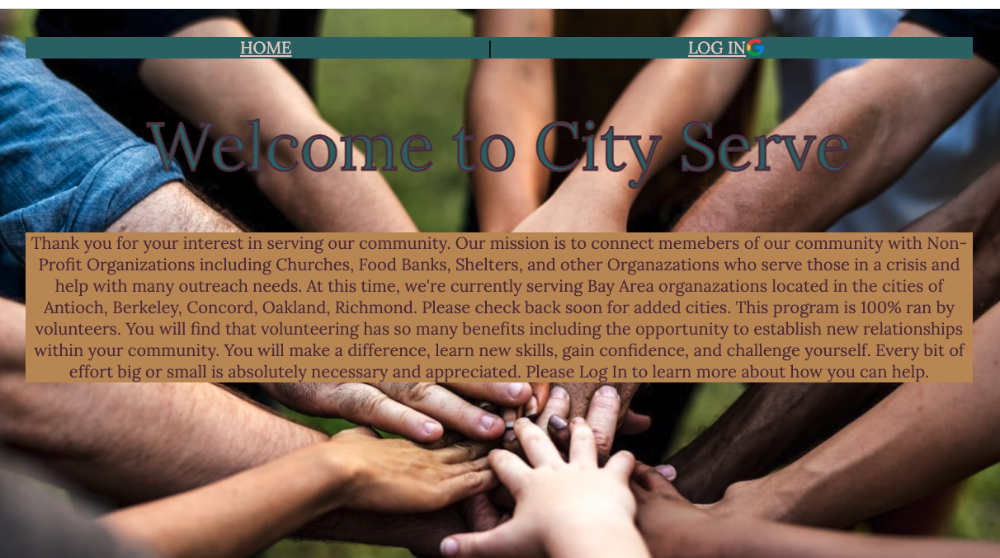
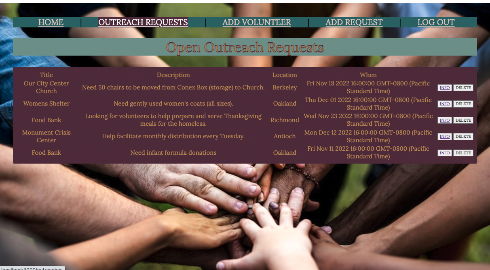
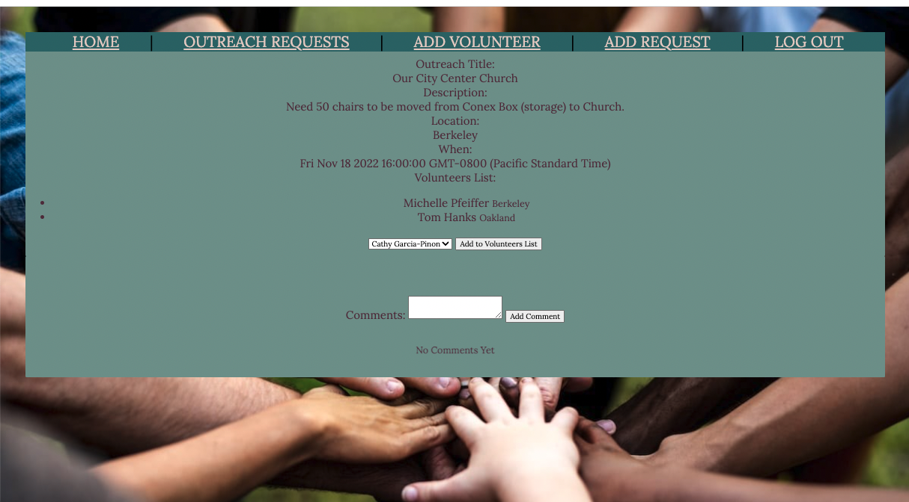
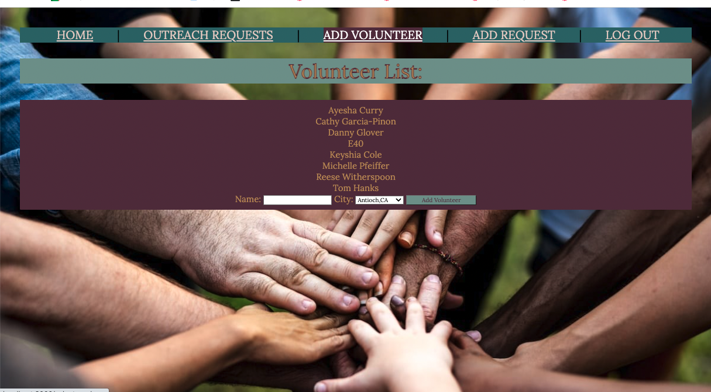
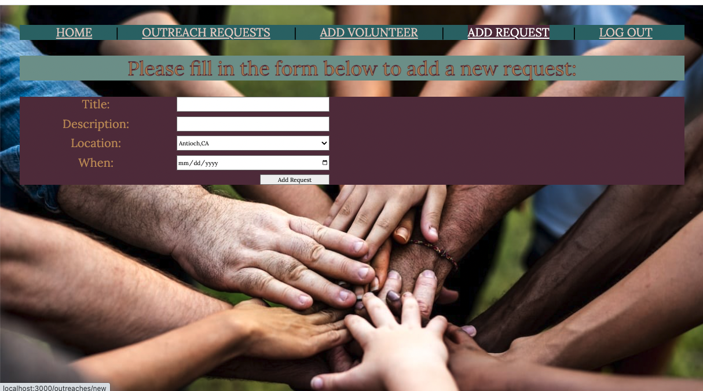

# City-Serve

City Serve is a place to get memebers of our community connected with non-profit organazation who have a need or pending outreach requests for volunteers.

## How to Navigate

Once logged in, click on thee Outreach Requests tab on the navigation bar.  This will take you to all the current Open Outreach Requests.

Click on the Info Link to get all details of the Outreach request including Volunteers already signed up, and the ability to leave a comment.

Add your name in the Volunteers Tab.

Non-profits can add a new Outreach request by clicking on the Add Request and filling out the form.

## Technologies Used

## LINK

https://city-serve-bayarea.herokuapp.com/

## Next Steps

- Implement sorting functionality for users to sort Outreach request by City or Organazation.
- Upload images to Outreach request
- Ability to use avatars